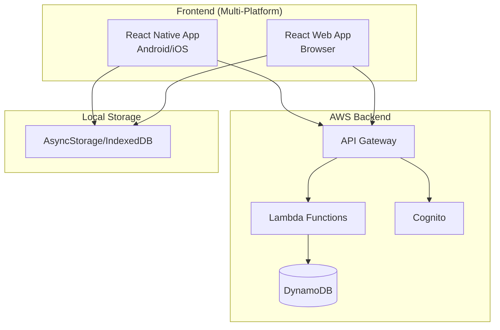

# Design Document: Sistema POS Cantina

## Overview

O Sistema POS Cantina é uma aplicação de ponto de venda para cantinas que permite gestão de eventos, menus, vendas, estoque e pagamentos. A arquitetura segue um modelo cliente-servidor com backend serverless na AWS e frontend multiplataforma usando React Native/React.

### Principais Funcionalidades
- Gestão de categorias de eventos (Culto, Kids, Casais) com hierarquia Categoria → Evento
- Gestão de eventos com múltiplos dias dentro de categorias
- Catálogo de itens reutilizável
- Menu dinâmico por evento/dia com controle de estoque
- Processamento de vendas com múltiplas formas de pagamento
- Sistema de crédito (fiado) com histórico de clientes
- Relatórios de vendas por evento e categoria
- Sincronização offline-first

## Architecture



### Padrão Arquitetural
- **Frontend**: React Native (mobile/tablet) + React (web) com código compartilhado
- **Backend**: Serverless (API Gateway + Lambda + DynamoDB)
- **Autenticação**: AWS Cognito (obrigatório para obter userId usado em auditoria)
- **Sincronização**: Offline-first com queue de operações pendentes

### Autenticação (Dependência para Auditoria)
O sistema utiliza AWS Cognito para autenticação. O `userId` do usuário autenticado é obtido do token JWT e usado em:
- Campo `createdBy` em Sales
- Campo `userId` em AuditLog
- Todas as operações que requerem rastreabilidade

## Components and Interfaces

### Frontend Components

```typescript
// Core Domain Types
interface EventCategory {
  id: string;
  name: string;
  isDefault: boolean;  // true for Culto, Kids, Casais
  eventCount: number;  // Computed field for UI
  createdAt: string;
  updatedAt: string;
}

interface Event {
  id: string;
  categoryId: string;  // Required - reference to EventCategory
  name: string;
  dates: string[]; // ISO date strings
  status: 'active' | 'closed';
  createdAt: string;
  updatedAt: string;
}

interface MenuGroup {
  id: string;
  name: string;
  order: number;
  isDefault: boolean;
}

interface CatalogItem {
  id: string;
  description: string;
  suggestedPrice: number;
  groupId: string;
  createdAt: string;
  updatedAt: string;
  deletedAt?: string; // Soft delete
}

interface MenuItem {
  id: string;
  eventId: string;
  catalogItemId: string;  // Reference to catalog item
  description: string;     // Snapshot at menu creation - NOT affected by catalog edits
  price: number;           // Snapshot - can differ from catalog suggestedPrice
  stock: number;           // 0 = infinite
  soldCount: number;
  groupId: string;
  // Note: description and price are snapshots taken when item is added to menu.
  // Changes to catalog item do NOT affect existing menu items.
}

interface OrderItem {
  menuItemId: string;
  description: string;
  price: number;
  quantity: number;
}

interface Order {
  id: string;
  eventId: string;
  items: OrderItem[];
  total: number;
  status: 'pending' | 'confirmed' | 'cancelled';
  createdAt: string;
}

type PaymentMethod = 'cash' | 'card' | 'transfer' | 'credit';

interface PaymentPart {
  method: PaymentMethod;
  amount: number;
}

interface Sale {
  id: string;
  eventId: string;
  orderId: string;
  items: OrderItem[];
  total: number;
  payments: PaymentPart[];
  customerId?: string; // For credit sales
  isPaid: boolean;
  isRefunded: boolean;
  refundReason?: string;
  refundedAt?: string;
  createdBy: string;  // User who created the sale (from Cognito)
  createdAt: string;
  // Note: refundedBy is tracked via AuditLog for consistency
}

interface Refund {
  id: string;
  saleId: string;
  reason: string;
  createdBy: string;
  createdAt: string;
}

interface Customer {
  id: string;
  name: string;
  createdAt: string;
  deletedAt?: string; // Soft delete
}

interface AuditLog {
  id: string;
  entityType: 'sale' | 'payment' | 'item' | 'price';
  entityId: string;
  action: 'create' | 'update' | 'delete' | 'refund';
  previousValue?: string;
  newValue?: string;
  userId: string;
  createdAt: string;
}

interface CustomerPayment {
  id: string;
  customerId: string;
  payments: PaymentPart[];
  totalAmount: number;
  createdAt: string;
}
```

### Service Interfaces

```typescript
// Event Category Service
interface IEventCategoryService {
  initializeDefaultCategories(): Promise<void>;  // Creates Culto, Kids, Casais if not exist
  getCategories(): Promise<EventCategory[]>;
  getCategory(id: string): Promise<EventCategory>;
  createCategory(name: string): Promise<EventCategory>;
  updateCategory(id: string, name: string): Promise<EventCategory>;
  deleteCategory(id: string): Promise<void>;  // Fails if has events
  getCategoryEventCount(id: string): Promise<number>;
}

// Event Service
interface IEventService {
  createEvent(categoryId: string, name: string, dates: string[]): Promise<Event>;
  getEvents(): Promise<Event[]>;
  getEventsByCategory(categoryId: string): Promise<Event[]>;
  getEvent(id: string): Promise<Event>;
  updateEventStatus(id: string, status: 'active' | 'closed'): Promise<Event>;
}

// Menu Service
interface IMenuService {
  getGroups(): Promise<MenuGroup[]>;
  createGroup(name: string): Promise<MenuGroup>;
  deleteGroup(id: string): Promise<void>;
  
  // includeDeleted defaults to false - soft-deleted items excluded from normal queries
  getCatalogItems(groupId?: string, includeDeleted?: boolean): Promise<CatalogItem[]>;
  searchCatalogItems(query: string): Promise<CatalogItem[]>; // Never includes deleted
  createCatalogItem(item: Omit<CatalogItem, 'id' | 'createdAt' | 'updatedAt' | 'deletedAt'>): Promise<CatalogItem>;
  updateCatalogItem(id: string, updates: Partial<CatalogItem>): Promise<CatalogItem>;
  deleteCatalogItem(id: string): Promise<void>; // Soft delete - sets deletedAt
  
  getMenuItems(eventId: string): Promise<MenuItem[]>;
  addMenuItem(eventId: string, item: Omit<MenuItem, 'id' | 'soldCount'>): Promise<MenuItem>;
  updateMenuItem(id: string, updates: Partial<MenuItem>): Promise<MenuItem>;
  removeMenuItem(id: string): Promise<void>;
}

// Order Service
interface IOrderService {
  createOrder(eventId: string): Promise<Order>;
  addItem(orderId: string, menuItemId: string, quantity: number): Promise<Order>;
  updateItemQuantity(orderId: string, menuItemId: string, quantity: number): Promise<Order>;
  removeItem(orderId: string, menuItemId: string): Promise<Order>;
  getOrder(orderId: string): Promise<Order>;
  calculateTotal(order: Order): number;
}

// Sales Service
interface ISalesService {
  confirmSale(orderId: string, payments: PaymentPart[], customerId?: string): Promise<Sale>;
  getSales(eventId: string): Promise<Sale[]>;
  getSalesByCustomer(customerId: string): Promise<Sale[]>;
  refundSale(saleId: string, reason: string): Promise<Refund>;
  getReceipt(saleId: string): Promise<Receipt>;
}

interface Receipt {
  saleId: string;
  eventName: string;
  items: {description: string, quantity: number, unitPrice: number, total: number}[];
  subtotal: number;
  total: number;
  payments: PaymentPart[];
  customerName?: string;
  createdAt: string;
  createdBy: string;
}

// Customer Service
interface ICustomerService {
  createCustomer(name: string): Promise<Customer>;
  searchCustomers(query: string): Promise<Customer[]>;
  getCustomer(id: string): Promise<Customer>;
  getCustomerBalance(customerId: string): Promise<number>;
  getCustomerHistory(customerId: string): Promise<{sales: Sale[], payments: CustomerPayment[]}>;
  registerPayment(customerId: string, payments: PaymentPart[]): Promise<CustomerPayment>;
}

// Report Service
interface IReportService {
  getEventReport(eventId: string): Promise<EventReport>;
  getCategoryReport(categoryId: string): Promise<CategoryReport>;  // Aggregates all events in category
  getReportByPeriod(startDate: string, endDate: string): Promise<EventReport>;
  getStockReport(eventId: string): Promise<StockReport>;
  exportReportCSV(eventId: string): Promise<string>;
  exportCategoryReportCSV(categoryId: string): Promise<string>;
}

interface CategoryReport {
  categoryId: string;
  categoryName: string;
  eventCount: number;
  totalSales: number;
  totalPaid: number;
  totalPending: number;
  totalRefunded: number;
  eventBreakdown: {eventId: string, eventName: string, total: number}[];
  paymentBreakdown: {method: PaymentMethod, total: number}[];
}

interface EventReport {
  eventId: string;
  totalSales: number;
  totalPaid: number;
  totalPending: number;
  totalRefunded: number;
  itemsSold: {description: string, quantity: number, total: number}[];
  paymentBreakdown: {method: PaymentMethod, total: number}[];
}

interface StockReport {
  eventId: string;
  items: {
    description: string;
    initialStock: number;
    sold: number;
    available: number;
    isInfinite: boolean;
  }[];
}
```

## Data Models

### DynamoDB Tables

```
Table: cantina-events
  PK: CATEGORY#{categoryId}
  SK: METADATA
  Attributes: name, isDefault, createdAt, updatedAt
  
  PK: CATEGORY#{categoryId}
  SK: EVENT#{eventId}
  Attributes: name, dates[], status, createdAt, updatedAt
  
  GSI: EventById
    PK: EVENT#{eventId}
    SK: METADATA

Table: cantina-menu
  PK: GROUP#{groupId}
  SK: METADATA
  Attributes: name, order, isDefault
  
  PK: CATALOG#{itemId}
  SK: METADATA
  Attributes: description, suggestedPrice, groupId, createdAt, updatedAt
  
  PK: EVENT#{eventId}
  SK: MENUITEM#{itemId}
  Attributes: catalogItemId, description, price, stock, soldCount, groupId

Table: cantina-sales
  PK: EVENT#{eventId}
  SK: SALE#{saleId}
  Attributes: orderId, items[], total, payments[], customerId, isPaid, createdAt
  
  GSI: CustomerSales
    PK: CUSTOMER#{customerId}
    SK: SALE#{saleId}

Table: cantina-customers
  PK: CUSTOMER#{customerId}
  SK: METADATA
  Attributes: name, createdAt
  
  PK: CUSTOMER#{customerId}
  SK: PAYMENT#{paymentId}
  Attributes: payments[], totalAmount, createdAt
```

## Correctness Properties

*A property is a characteristic or behavior that should hold true across all valid executions of a system-essentially, a formal statement about what the system should do. Properties serve as the bridge between human-readable specifications and machine-verifiable correctness guarantees.*

Based on the prework analysis, the following correctness properties have been identified:

### Property 1: Default Categories Initialization
*For any* first initialization of the system, the categories list SHALL contain exactly three default categories: Culto, Kids, and Casais.
**Validates: Requirements 1.1**

### Property 2: Category Management Consistency
*For any* category that is created, it SHALL appear in the list of categories, and *for any* category without associated events that is deleted, it SHALL no longer appear in the list.
**Validates: Requirements 1.3, 1.6**

### Property 3: Category Deletion Protection
*For any* category with associated events, attempting to delete it SHALL fail and the category SHALL remain in the list.
**Validates: Requirements 1.5**

### Property 4: Event Category Association
*For any* event creation request with valid categoryId, name, and dates, the created event SHALL belong to the specified category and contain all provided fields.
**Validates: Requirements 2.2, 2.3, 2.4**

### Property 5: Events By Category Query
*For any* category, querying events by that category SHALL return only events that belong to that category.
**Validates: Requirements 2.1**

### Property 6: Group Management Consistency
*For any* menu group that is created, it SHALL appear in the list of available groups, and *for any* group without associated menu items that is deleted, it SHALL no longer appear in the list.
**Validates: Requirements 3.2, 3.3**

### Property 7: Group Deletion Protection
*For any* menu group with associated menu items in the current event, attempting to delete it SHALL fail and the group SHALL remain in the list.
**Validates: Requirements 3.4**

### Property 8: Catalog Item Persistence
*For any* catalog item created with description, price, and group, querying the catalog SHALL return an item with identical field values.
**Validates: Requirements 4.1, 5.4**

### Property 9: Catalog Search Correctness
*For any* search query on the catalog, all returned items SHALL contain the query string in their description OR belong to a group matching the query.
**Validates: Requirements 4.3**

### Property 10: Order Total Calculation
*For any* order with items, the total SHALL equal the sum of (price × quantity) for all items in the order.
**Validates: Requirements 6.2, 6.3, 6.4**

### Property 11: Infinite Stock Behavior
*For any* menu item with stock defined as zero, confirming sales SHALL NOT decrement the stock and the item SHALL remain available regardless of quantity sold.
**Validates: Requirements 5.3**

### Property 12: Stock Decrement Consistency
*For any* menu item with finite stock (stock > 0), after confirming a sale, the remaining stock SHALL equal (initial stock - quantity sold).
**Validates: Requirements 7.1**

### Property 13: Stock Exhaustion Availability
*For any* menu item with finite stock, when soldCount equals initial stock, the item SHALL be marked as unavailable.
**Validates: Requirements 7.2**

### Property 14: Stock Limit Enforcement
*For any* attempt to add quantity exceeding available stock to an order, the system SHALL limit the quantity to the available stock.
**Validates: Requirements 7.4**

### Property 15: Payment Total Consistency
*For any* confirmed sale with mixed payments, the sum of all payment amounts SHALL equal the order total.
**Validates: Requirements 8.3**

### Property 16: Sale Record Completeness
*For any* confirmed sale, the sale record SHALL contain all items, individual prices, quantities, total, payment method(s), and timestamp.
**Validates: Requirements 8.4**

### Property 17: Credit Sale Customer Association
*For any* sale with payment method 'credit', the sale SHALL be associated with a customer and marked as unpaid.
**Validates: Requirements 9.4**

### Property 18: Customer Balance Calculation
*For any* customer, the pending balance SHALL equal the sum of all unpaid sale totals minus the sum of all registered payments.
**Validates: Requirements 10.3**

### Property 19: Customer History Completeness
*For any* customer, the history SHALL contain all sales (paid and unpaid) and all payment records associated with that customer.
**Validates: Requirements 10.2, 10.6**

### Property 20: Event Report Aggregation
*For any* event report, the total sales SHALL equal the sum of all individual sale totals, and items sold SHALL accurately reflect quantities from all sales.
**Validates: Requirements 11.1**

### Property 21: Category Report Aggregation
*For any* category report, the aggregated data SHALL include totals from all events belonging to that category.
**Validates: Requirements 11.2**

### Property 22: Data Persistence Round-Trip
*For any* entity (category, event, item, sale, customer) that is created and persisted, retrieving it SHALL return an entity with equivalent field values.
**Validates: Requirements 12.1**

### Property 23: Order Cancellation Stock Release
*For any* order that is cancelled before confirmation, all reserved items SHALL be released back to available stock.
**Validates: Requirements 14.1, 14.2**

### Property 24: Refund Stock Restoration
*For any* sale that is refunded, the stock of each item SHALL be incremented by the quantity originally sold.
**Validates: Requirements 15.1**

### Property 25: Refund Credit Balance Adjustment
*For any* credit sale that is refunded, the customer's pending balance SHALL be reduced by the refunded amount.
**Validates: Requirements 15.2**

### Property 26: Input Validation - Price Positivity
*For any* item creation or update, the price SHALL be greater than zero.
**Validates: Requirements 16.1**

### Property 27: Input Validation - Name Non-Empty
*For any* event, category, or customer creation, the name SHALL be non-empty after trimming whitespace.
**Validates: Requirements 16.2**

### Property 28: Audit Trail Completeness
*For any* sale, payment, or price change, an audit log entry SHALL be created with user identifier and timestamp.
**Validates: Requirements 18.1, 18.2, 18.3**

### Property 29: Soft Delete Catalog Isolation
*For any* catalog item that is soft-deleted, it SHALL NOT appear in catalog searches but SHALL remain in historical menu references.
**Validates: Requirements 4.5**

## Error Handling

### Frontend Error Handling
- **Network Errors**: Queue operations locally, retry with exponential backoff
- **Validation Errors**: Display inline error messages, prevent submission
- **Stock Errors**: Show warning, auto-adjust quantity to available stock
- **Sync Conflicts**: Last-write-wins with conflict notification

### Backend Error Handling
- **DynamoDB Errors**: Return appropriate HTTP status codes (400, 404, 500)
- **Validation Errors**: Return 400 with detailed error messages
- **Authorization Errors**: Return 401/403 with redirect to login

### Error Response Format
```typescript
interface ErrorResponse {
  code: string;
  message: string;
  details?: Record<string, string>;
}

// Error Codes
const ErrorCodes = {
  ERR_STOCK_INSUFFICIENT: 'Estoque insuficiente para a quantidade solicitada',
  ERR_DUPLICATE_NAME: 'Já existe um registro com este nome',
  ERR_INVALID_PRICE: 'O preço deve ser maior que zero',
  ERR_EMPTY_NAME: 'O nome não pode estar vazio',
  ERR_INVALID_QUANTITY: 'A quantidade deve ser maior que zero',
  ERR_SALE_ALREADY_REFUNDED: 'Esta venda já foi estornada',
  ERR_GROUP_HAS_ITEMS: 'Não é possível excluir grupo com itens associados',
  ERR_CATEGORY_HAS_EVENTS: 'Não é possível excluir categoria com eventos associados',
  ERR_CATEGORY_NOT_FOUND: 'Categoria não encontrada',
  ERR_EVENT_NOT_FOUND: 'Evento não encontrado',
  ERR_CUSTOMER_NOT_FOUND: 'Cliente não encontrado',
  ERR_PAYMENT_MISMATCH: 'Soma dos pagamentos não corresponde ao total',
};
```

## Testing Strategy

### Unit Testing
- Framework: Jest
- Coverage target: 80% for business logic
- Focus areas:
  - Order total calculation
  - Stock management logic
  - Customer balance calculation
  - Payment validation

### Property-Based Testing
- Framework: fast-check (JavaScript/TypeScript)
- Minimum iterations: 100 per property
- Each property test MUST be tagged with: `**Feature: cantina-pos, Property {number}: {property_text}**`

Property tests will cover:
1. Order total calculation invariants
2. Stock decrement consistency
3. Payment sum validation
4. Customer balance calculation
5. Data persistence round-trips

### Integration Testing
- API endpoint testing with supertest
- DynamoDB Local for database tests
- End-to-end flows for critical paths:
  - Complete sale flow (menu → order → payment)
  - Credit sale and payment flow
  - Stock exhaustion flow

### Test Organization
```
src/
  services/
    __tests__/
      order.service.test.ts
      order.service.property.test.ts
      sales.service.test.ts
      customer.service.test.ts
  api/
    __tests__/
      events.api.test.ts
      menu.api.test.ts
```
