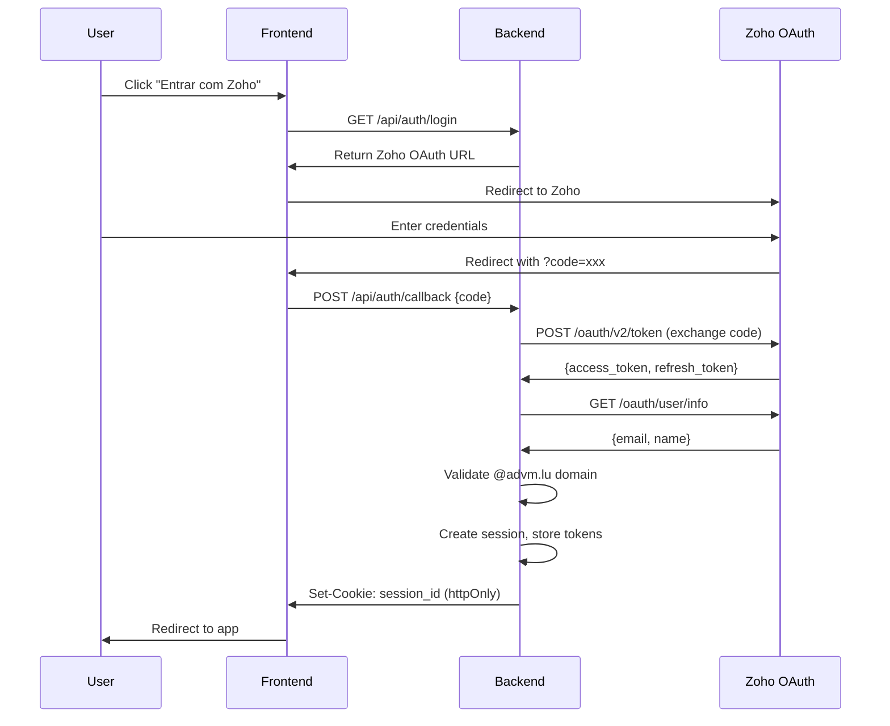

# Design Document: Zoho OAuth Authentication

## Overview

Este documento descreve a arquitetura e implementação de autenticação OAuth 2.0 com Zoho para o sistema Cantina ADVM. A solução utiliza o padrão Backend for Frontend (BFF) para manter o client_secret seguro, com sessões gerenciadas por cookies httpOnly.

### Key Design Decisions

1. **BFF Pattern**: O backend gerencia todo o fluxo OAuth, tokens nunca são expostos ao frontend
2. **Session-based Auth**: Cookies httpOnly ao invés de tokens no localStorage (mais seguro contra XSS)
3. **In-memory Session Store**: Para MVP, sessões em memória. Pode migrar para DynamoDB depois
4. **Domain Restriction**: Apenas emails @advm.lu podem acessar o sistema

## Zoho API Console Setup

Antes de implementar, você precisa criar uma aplicação no Zoho API Console:

1. Acesse https://api-console.zoho.eu/ (EU datacenter)
2. Clique em "ADD CLIENT"
3. Selecione "Server-based Applications"
4. Preencha:
   - Client Name: `Cantina ADVM`
   - Homepage URL: `https://cantina.advm.lu`
   - Authorized Redirect URIs: `https://cantina.advm.lu/api/auth/callback`
   - (Para dev local adicione também: `http://localhost:3000/api/auth/callback`)
5. Clique em "CREATE"
6. Copie o Client ID e Client Secret gerados

## Architecture



## Components and Interfaces

### Backend Components

#### 1. AuthController (`/api/auth/*`)

Handles all authentication endpoints:

```typescript
interface AuthController {
  // GET /api/auth/login - Returns Zoho OAuth URL
  getLoginUrl(): { url: string };
  
  // POST /api/auth/callback - Exchange code for session
  handleCallback(code: string): Promise<{ user: UserInfo }>;
  
  // GET /api/auth/me - Get current user
  getCurrentUser(): UserInfo | null;
  
  // POST /api/auth/logout - End session
  logout(): void;
}
```

#### 2. ZohoOAuthService

Handles communication with Zoho OAuth APIs:

```typescript
interface ZohoOAuthService {
  // Generate authorization URL with all required params
  getAuthorizationUrl(state: string): string;
  
  // Exchange authorization code for tokens
  exchangeCodeForTokens(code: string): Promise<TokenResponse>;
  
  // Refresh access token using refresh token
  refreshAccessToken(refreshToken: string): Promise<TokenResponse>;
  
  // Get user info from Zoho
  getUserInfo(accessToken: string): Promise<ZohoUserInfo>;
  
  // Revoke tokens on logout
  revokeToken(token: string): Promise<void>;
}

interface TokenResponse {
  access_token: string;
  refresh_token?: string;
  expires_in: number;
  token_type: string;
}

interface ZohoUserInfo {
  ZUID: string;           // Zoho User ID
  Email: string;          // User email
  Display_Name: string;   // Full display name
  First_Name?: string;    // May not be present
  Last_Name?: string;     // May not be present
}
```

#### 3. SessionService

Manages user sessions:

```typescript
interface Session {
  id: string;
  userId: string;
  email: string;
  displayName: string;
  accessToken: string;
  refreshToken: string;
  accessTokenExpiresAt: number;
  createdAt: number;
}

interface SessionService {
  createSession(user: ZohoUserInfo, tokens: TokenResponse): Session;
  getSession(sessionId: string): Session | null;
  updateSession(sessionId: string, updates: Partial<Session>): void;
  deleteSession(sessionId: string): void;
  isAccessTokenExpired(session: Session): boolean;
}
```

#### 4. AuthMiddleware

Express middleware for protecting routes:

```typescript
interface AuthMiddleware {
  // Middleware that requires valid session
  requireAuth(req: Request, res: Response, next: NextFunction): void;
  
  // Middleware that attaches user if authenticated (optional auth)
  optionalAuth(req: Request, res: Response, next: NextFunction): void;
}
```

### Frontend Components

#### 1. AuthContext & AuthProvider

React context for authentication state:

```typescript
interface AuthContextValue {
  user: User | null;
  isAuthenticated: boolean;
  isLoading: boolean;
  error: string | null;
  login: () => void;
  logout: () => Promise<void>;
}

interface User {
  email: string;
  displayName: string;
}
```

#### 2. useAuth Hook

```typescript
function useAuth(): AuthContextValue;
```

#### 3. LoginPage Component

Displays login UI with Zoho button.

#### 4. ProtectedRoute Component

HOC that redirects to login if not authenticated.

## Data Models

### Session (Backend - In Memory)

```typescript
interface Session {
  id: string;              // UUID v4
  userId: string;          // Zoho ZUID
  email: string;           // User email
  displayName: string;     // User display name
  accessToken: string;     // Zoho access token
  refreshToken: string;    // Zoho refresh token
  accessTokenExpiresAt: number;  // Unix timestamp
  createdAt: number;       // Unix timestamp
}
```

### AuthState (Frontend)

```typescript
interface AuthState {
  user: User | null;
  isAuthenticated: boolean;
  isLoading: boolean;
  error: string | null;
}
```

## Correctness Properties

*A property is a characteristic or behavior that should hold true across all valid executions of a system-essentially, a formal statement about what the system should do. Properties serve as the bridge between human-readable specifications and machine-verifiable correctness guarantees.*

### Property 1: OAuth URL Generation

*For any* valid client_id and redirect_uri, the generated OAuth authorization URL SHALL contain all required parameters: client_id, response_type=code, scope=AaaServer.profile.Read, redirect_uri, and access_type=offline.

**Validates: Requirements 1.1, 6.1**

### Property 2: Email Domain Validation

*For any* email address, the domain validation function SHALL return true if and only if the email ends with @advm.lu (case-insensitive).

**Validates: Requirements 1.5, 1.6**

### Property 3: Session Validity

*For any* valid session with non-expired access token, requests to protected endpoints SHALL succeed and return the associated user information.

**Validates: Requirements 2.2, 3.2**

### Property 4: Token Refresh Transparency

*For any* session with expired access token but valid refresh token, the system SHALL automatically refresh the token and complete the request without returning an error to the client.

**Validates: Requirements 2.3, 3.3**

### Property 5: Unauthenticated Request Rejection

*For any* request to a protected endpoint without a valid session cookie, the system SHALL return HTTP 401 Unauthorized.

**Validates: Requirements 3.1, 3.4**

### Property 6: Cookie Security Attributes

*For any* response that sets a session cookie, the cookie SHALL have httpOnly=true, secure=true (in production), and sameSite=strict attributes.

**Validates: Requirements 6.5**

### Property 7: Auth State Serialization Round-Trip

*For any* valid auth state object, serializing to JSON and deserializing back SHALL produce an equivalent object.

**Validates: Requirements 5.2**

## Error Handling

### Error Codes

| Code | HTTP Status | Description |
|------|-------------|-------------|
| AUTH_REQUIRED | 401 | No session cookie present |
| SESSION_EXPIRED | 401 | Session exists but tokens invalid |
| SESSION_NOT_FOUND | 401 | Session ID not found in store |
| INVALID_CODE | 400 | Authorization code invalid or expired |
| DOMAIN_NOT_ALLOWED | 403 | Email domain not @advm.lu |
| ZOHO_ERROR | 502 | Error communicating with Zoho |

### Error Response Format

```typescript
interface AuthError {
  code: string;
  message: string;
  details?: Record<string, unknown>;
}
```

## Testing Strategy

### Property-Based Testing

Utilizaremos **fast-check** para property-based testing em TypeScript.

Propriedades a testar:
1. URL generation always includes required OAuth parameters
2. Domain validation correctly filters emails
3. Session lookup returns correct user for valid sessions
4. Cookie attributes are always secure

Configuração: Mínimo de 100 iterações por propriedade.

Formato de tag para testes:
```typescript
// **Feature: zoho-oauth-auth, Property 1: OAuth URL Generation**
```

### Unit Tests

- ZohoOAuthService: Mock Zoho API responses
- SessionService: Test CRUD operations
- AuthMiddleware: Test request/response handling
- Domain validation: Edge cases (empty, null, similar domains)

### Integration Tests

- Full OAuth callback flow (with mocked Zoho)
- Session persistence across requests
- Token refresh flow

## File Structure

```
packages/backend/src/
├── auth/
│   ├── auth.controller.ts      # Route handlers
│   ├── auth.middleware.ts      # Express middleware
│   ├── auth.routes.ts          # Route definitions
│   ├── session.service.ts      # Session management
│   ├── zoho-oauth.service.ts   # Zoho API client
│   ├── domain-validator.ts     # Email domain validation
│   └── __tests__/
│       ├── auth.controller.test.ts
│       ├── auth.middleware.test.ts
│       ├── session.service.test.ts
│       ├── zoho-oauth.service.test.ts
│       ├── domain-validator.test.ts
│       └── auth.properties.test.ts  # Property-based tests

packages/frontend-web/src/
├── auth/
│   ├── AuthContext.tsx         # React context
│   ├── AuthProvider.tsx        # Context provider
│   ├── useAuth.ts              # Auth hook
│   ├── ProtectedRoute.tsx      # Route guard
│   ├── LoginPage.tsx           # Login UI
│   └── __tests__/
│       └── auth.test.tsx
```
